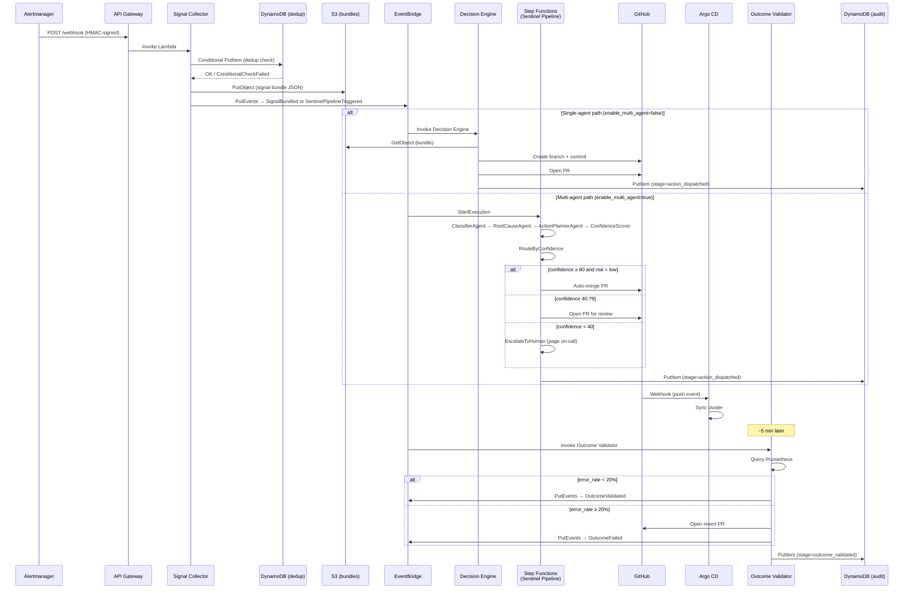
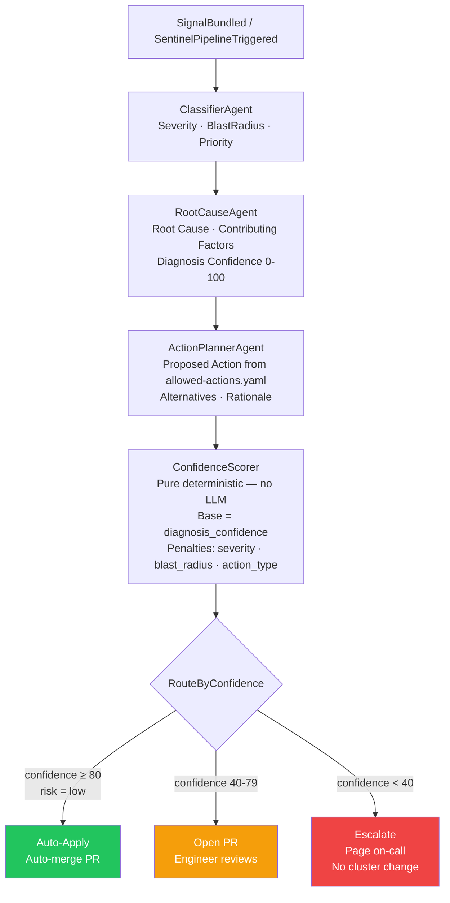
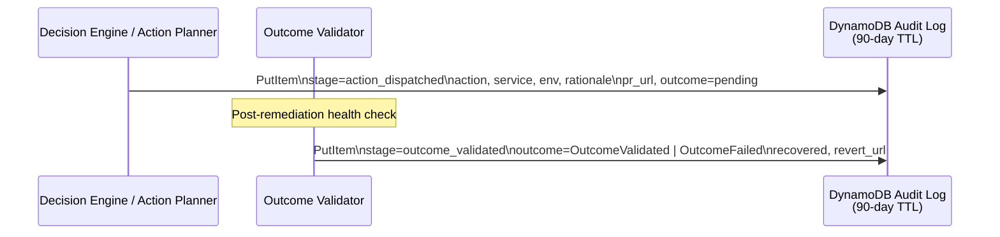
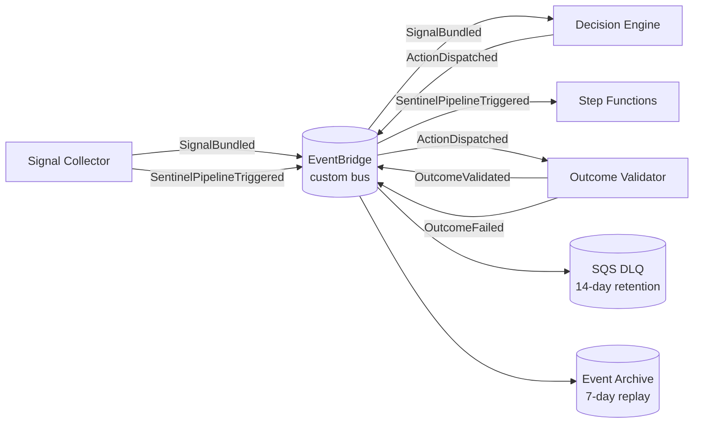

# GitOps Sentinel — Architecture Diagrams

## 1. End-to-End Signal Flow

---

## 2. Confidence-Gated Routing (Step Functions)

---

## 3. Audit Trail Write Path

---

## 4. EventBridge Event Topology

