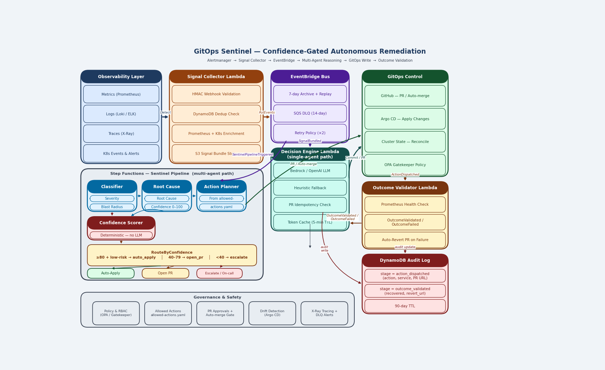

# GitOps Sentinel — Confidence-Gated Autonomous Remediation

An AWS-native platform that turns production alerts into **confidence-scored remediation decisions**, enforces guardrails with **CI + Gatekeeper**, and verifies recovery with **PromQL** — optionally opening an **auto-revert PR** on failure.

> **Key principle:** No agent ever writes directly to the cluster. All changes flow through GitOps pull requests.

## Architecture

**Core components**
- EKS + Argo CD (GitOps reconciliation)
- Prometheus / Alertmanager (signals)
- API Gateway → Signal Collector (incident context + dedup)
- EventBridge (event routing)
- Decision Engine (PR creation; Bedrock / OpenAI / heuristic fallback)
- Outcome Validator (PromQL check; optional revert PR + Slack)
- Step Functions multi-agent pipeline: Classifier → Root Cause → Action Planner → Confidence Scorer
- DynamoDB (dedup + audit log), S3 (signal bundles)

## End-to-end flow
1. Alert fires → `POST /webhook`
2. Signal Collector deduplicates, enriches, writes S3 bundle → emits `SignalBundled`
3. Decision Engine (or Sentinel Pipeline) reads bundle + allowed-actions → opens PR
4. Merge PR → Argo CD applies change
5. GitHub Actions emits `ActionDispatched`
6. Outcome Validator checks recovery → `OutcomeValidated` / `OutcomeFailed` (+ optional auto-revert PR)

## Confidence-gated routing
| Score | Risk | Action |
|---|---|---|
| ≥ 80 | low | `auto_apply` — PR merged automatically |
| 40–79 | any | `open_pr` — human review required |
| < 40 | any | `escalate` — PagerDuty / Slack alert |

## Guardrails
- Allowed actions contract: `gitops/policies/allowed-actions.yaml`
- CI checks: kustomize build + policy-check workflow
- Gatekeeper bounds: `gitops/policies/gatekeeper/*`
- Every decision recorded in DynamoDB Audit Log (90-day TTL)

## Quickstart
1. Create `terraform/terraform.tfvars` from `terraform/terraform.tfvars.example`
2. `cd terraform && terraform init && terraform apply`
3. Update `repoURL` in `gitops/argocd/application-*.yaml` and apply
4. Configure Alertmanager webhook with Terraform output `webhook_url`
5. Trigger an alert and watch the PR appear

## Demo
See `docs/demo-script.md` and `docs/runbook-operator.md`.

## License
MIT
